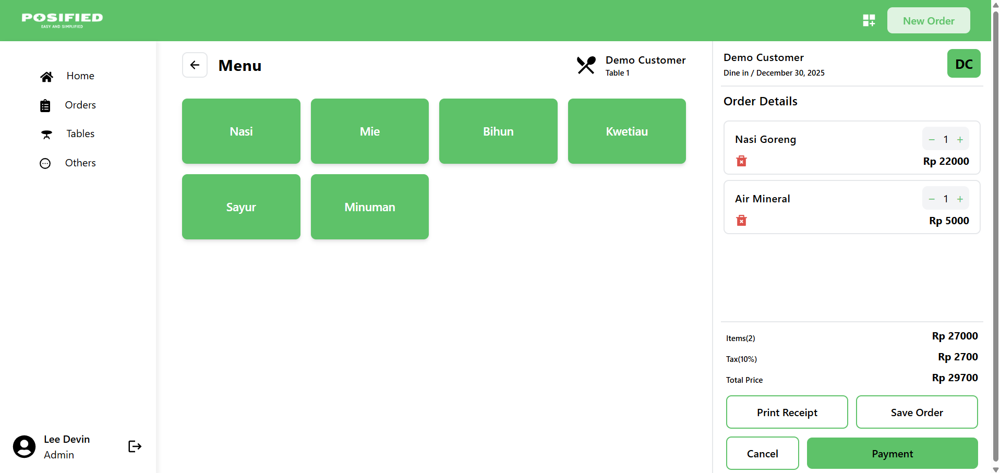

# POSIFIED - A Full Stack Web Based Point Of Sale Application Using MERN Stack

POSIFIED, which stands for Point Of Sale Simplified, is a fully functional MERN POS application built specifically for culinary MSMEs. The UI/UX and application flow are intentionally kept simple to make the application easier to use.

## Features

- Authentication & authorization
- Category, order, product, table, transaction, and user management
- Modern and attractive UI

## Tech Stack

- React
- Express JS
- Node JS
- MongoDB

## Project Visual Documentation

## Try Using The POS Application!

This project has been hosted on Vercel and Render. You can access it via the URL below:
[Vercel Link](https://posified2025.vercel.app)

## How To Run The POS Application Locally

- Clone this project
- Install all the packages (npm install)
- Create your own environmental variables in .env files
  - Backend: .env includes PORT, MONGO_URI, JWT_SECRET
  - Frontend: .env includes VITE_BACKEND_URL
- Configure the cors settings in server.js
- Run both the backend and frontend (npm run dev) in each directory

## Project Status

This project is currently in **MVP Stage** and under active development. The core features are implemented, while additional functionalities are planned for future iterations.